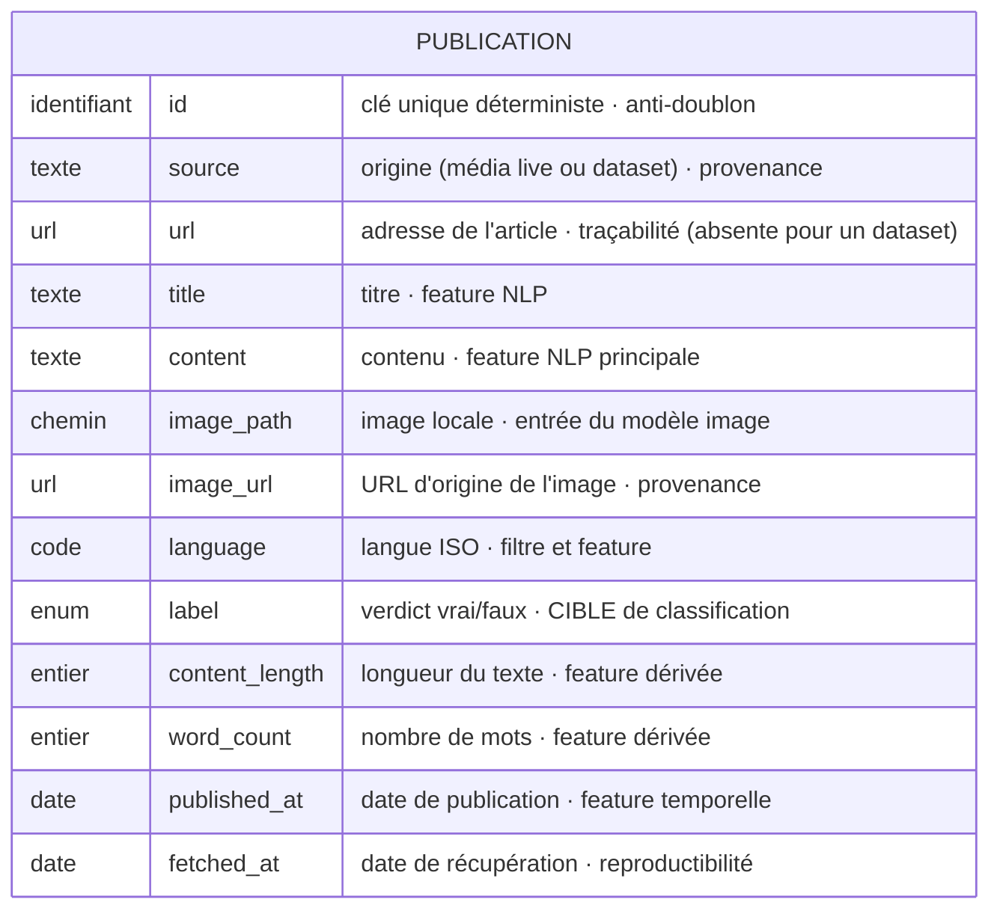
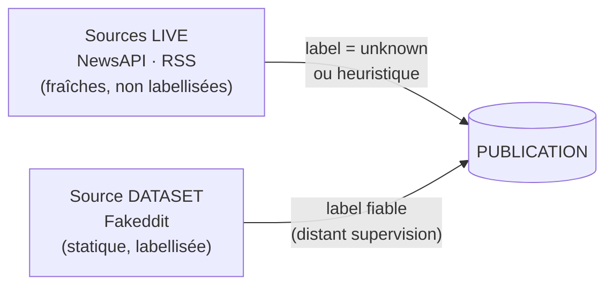

# Schéma conceptuel des données — CheckIt.AI

**Livrable :** Étape 3 — Modèle conceptuel des données
**Cas d'usage :** entraînement d'un détecteur de désinformation multimodale (classification, NLP)

## 1. Conceptuel ≠ technique

Ce document décrit la **signification métier** des données (entités, attributs, rôles),
indépendamment du stockage. Ce n'est pas le schéma technique (la table PostgreSQL).
Les « types » indiqués sont **conceptuels** (texte, URL, date, entier, énumération…),
pas des types SGBD (`TEXT`, `TIMESTAMP`, `INTEGER`…).

| | Modèle conceptuel (ici) | Schéma technique (PostgreSQL) |
|---|---|---|
| Objet | signification métier | stockage physique |
| Vocabulaire | entités, attributs, rôles | table, colonnes, types, clé primaire |
| Exemple de type | texte, date | `TEXT`, `TIMESTAMP` |

## 2. Diagramme

## 3. Lien texte ↔ image (exigence multimodale)

Le texte (`title`, `content`) et l'image (`image_path`, `image_url`) sont des attributs
de **la même entité `Publication`** : ils cohabitent dans un même enregistrement, ce qui
garantit structurellement leur appariement. Une publication n'est conservée que si son
image a été téléchargée et validée (`image_path` renseigné). Pas d'image ⇒ pas de publication.

## 4. Rôle de chaque champ dans le cas d'usage IA

| Champ | Type conceptuel | Rôle |
|---|---|---|
| `title`, `content` | texte | **feature NLP** (entrée du modèle texte) |
| `image_path` | chemin | **entrée du modèle image** (branche visuelle) |
| `label` | énumération | **cible de classification** (défaut `unknown`) |
| `content_length`, `word_count` | entier | **features dérivées** |
| `language` | code | feature + filtrage |
| `published_at` | date | feature temporelle |
| `source`, `url`, `image_url` | texte / URL | **métadonnées de provenance** |
| `id`, `fetched_at` | identifiant / date | **traçabilité et reproductibilité** |

## 5. Contraintes d'intégrité (conceptuelles)

- `id` est **unique** (déterministe) → pas de doublon.
- Une publication conservée possède **obligatoirement** un `image_path` valide.
- `label` ∈ {vrai, faux, mixte, opinion, inconnu} ; par défaut `inconnu`.
- `source` décrit la provenance : ce n'est **pas** un indicateur de véracité.

## 6. Deux voies d'ingestion (architecture hybride)

La même entité `Publication` est alimentée par **deux types de sources complémentaires**,
qui se distinguent par la **provenance du label** :

- **Sources live** (NewsAPI, RSS) : données fraîches, rafraîchies par les DAGs planifiés.
  Le `label` est `unknown`, ou déduit par heuristique prudente sur les flux fact-check.
- **Source dataset** (Fakeddit) : données statiques à **label fiable**, chargées une fois
  (DAG one-shot `seed_fakeddit`). Elles constituent le socle de vérité terrain pour l'entraînement.

Cette complémentarité — flux frais pour la production, dataset annoté pour l'entraînement —
correspond à l'architecture attendue en amont d'un détecteur multimodal.

## 7. Évolution possible

Dans une version normalisée, `source` et `label` pourraient devenir des entités distinctes
reliées à `Publication`. Le choix d'une table unique est assumé : plus simple, suffisant pour
ce volume et ce cas d'usage.
